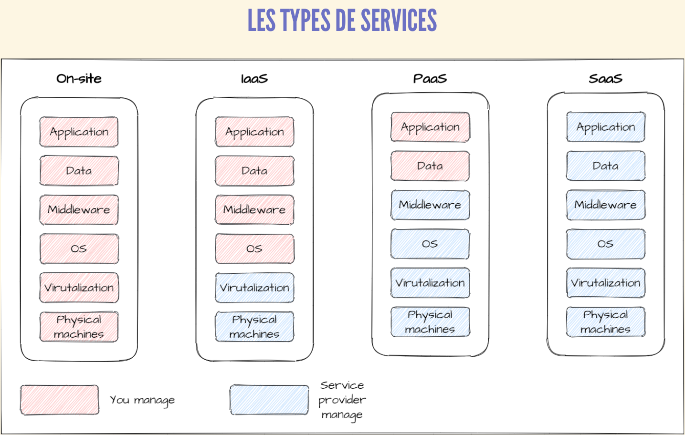

# Module 1 : Introduction au Cloud et à l'Infrastructure as Code (IaC) ☁️⚙️

Bienvenue dans ce premier module ! L'objectif ici est de poser des bases solides pour que vous compreniez bien les concepts fondamentaux avant de plonger dans la pratique avec AWS et Terraform. On va démystifier le jargon et s'assurer que tout le monde est sur la même longueur d'onde.

Prêts à décoller ? 🚀

## 🎯 Ce que vous allez apprendre dans ce module :

*   Comprendre les différences entre **IaaS, PaaS et SaaS**.
*   Découvrir pourquoi **AWS** est un acteur majeur du cloud.
*   Saisir l'importance de l'**Infrastructure as Code (IaC)**.
*   Faire connaissance avec **Terraform** et ses principes.
*   Préparer votre environnement et lancer votre premier `terraform apply` (oui, déjà !).

---

## 1. Les Concepts Clés du Cloud Computing 🌩️

Le "Cloud Computing", c'est un peu comme l'électricité : vous l'utilisez sans vous soucier de la centrale qui la produit. Il s'agit de fournir des services informatiques (serveurs, stockage, bases de données, réseaux, logiciels, etc.) via Internet ("le Cloud").

Il existe principalement trois modèles de services cloud :

### a. IaaS (Infrastructure as a Service) 🏗️

*   **C'est quoi ?** C'est la base ! Le fournisseur de cloud vous donne accès à des ressources d'infrastructure brutes : machines virtuelles (comme EC2 chez AWS), stockage, réseaux.
*   **Vous gérez :** Le système d'exploitation, les applications, les données.
*   **Le fournisseur gère :** L'infrastructure physique sous-jacente (serveurs, data centers).
*   **Analogie simple :** Vous louez le terrain et les matériaux de construction (serveurs virtuels, disques durs). C'est à vous de construire votre maison (installer l'OS, vos applications).
*   **Exemples :** Amazon EC2, Microsoft Azure VMs, Google Compute Engine.

### b. PaaS (Platform as a Service) 🧩

*   **C'est quoi ?** Un cran au-dessus ! Le fournisseur vous donne une plateforme complète pour développer, exécuter et gérer des applications sans vous soucier de l'infrastructure.
*   **Vous gérez :** Vos applications et vos données.
*   **Le fournisseur gère :** Le système d'exploitation, les serveurs, le stockage, les réseaux, les bases de données, les outils de développement.
*   **Analogie simple :** Vous louez un atelier entièrement équipé (outils, établis). Vous venez avec vos plans et vos matériaux pour créer votre produit (votre application).
*   **Exemples :** AWS Elastic Beanstalk, Heroku, Google App Engine, SAP Cloud Platform.

### c. SaaS (Software as a Service) 📧

*   **C'est quoi ?** C'est le produit fini ! Le fournisseur vous donne accès à un logiciel complet, prêt à l'emploi, via Internet, souvent sur la base d'un abonnement.
*   **Vous gérez :** (Presque) rien, à part peut-être la configuration de votre compte utilisateur.
*   **Le fournisseur gère :** Tout ! L'application, les données, l'infrastructure, la maintenance.
*   **Analogie simple :** Vous vous abonnez à un service de streaming vidéo. Vous ne vous occupez que de choisir votre film, pas de comment il est stocké ou diffusé.
*   **Exemples :** Gmail, Salesforce, Dropbox, Microsoft Office 365, Netflix.

**Récapitulatif rapide :**

| Modèle | Vous Gérez                               | Le Fournisseur Gère                        | Analogie (simplifiée) |
| :----- | :--------------------------------------- | :----------------------------------------- | :-------------------- |
| IaaS   | 🤖 OS, 💻 Applications, 📊 Données        | 🔩 Serveurs, 💾 Stockage, 🌐 Réseau       | Louer le terrain      |
| PaaS   | 💻 Applications, 📊 Données              | 🤖 OS, 🔩 Serveurs, 💾 Stockage, 🌐 Réseau | Louer l'atelier équipé |
| SaaS   | 👤 (Utilisation et configuration de base) | ✨ Tout                                    | S'abonner au service  |

---

## 2. Pourquoi AWS (Amazon Web Services) ? 🌟

Amazon Web Services (AWS) est le pionnier et le leader mondial du Cloud Computing. Pourquoi tant d'entreprises et de développeurs choisissent AWS ?

*   🌍 **La plus large gamme de services :** Des centaines de services couvrant le calcul, le stockage, les bases de données, l'analytique, le machine learning, l'IoT, la sécurité, et bien plus !
*   💪 **Fiabilité et Maturité :** Une infrastructure globale éprouvée, avec des régions et zones de disponibilité partout dans le monde.
*   📈 **Scalabilité et Flexibilité :** Adaptez vos ressources à la demande, payez uniquement ce que vous consommez.
*   💡 **Innovation constante :** AWS innove à un rythme effréné, ajoutant sans cesse de nouvelles fonctionnalités et services.
*   🛡️ **Sécurité :** Une priorité absolue, avec de nombreux outils et certifications pour protéger vos données.
*   👥 **Grande communauté et écosystème :** Beaucoup de documentation, de forums, de partenaires et d'outils tiers (comme Terraform !).

Dans ce cours, nous allons nous concentrer sur quelques-uns des services les plus populaires et fondamentaux d'AWS.

---

## 3. Introduction à l'Infrastructure as Code (IaC) 📜➡️🏗️

Imaginez devoir configurer 10 serveurs identiques à la main via une interface web. C'est long, répétitif et source d'erreurs, non ? 😩

L'**Infrastructure as Code (IaC)** vient à la rescousse !

*   **C'est quoi ?** C'est la pratique qui consiste à gérer et provisionner votre infrastructure (serveurs, réseaux, bases de données, etc.) en utilisant des fichiers de configuration lisibles par l'homme, plutôt que par des configurations manuelles ou des scripts impératifs.
*   **Le principe :** Vous décrivez l'état désiré de votre infrastructure dans du code. Un outil IaC se charge ensuite de traduire cette description en ressources réelles chez votre fournisseur cloud.

**Pourquoi c'est génial ?** 🤔

*   ⚙️ **Automatisation :** Déployez et mettez à jour votre infrastructure de manière rapide et fiable. Fini les clics manuels !
*   🔄 **Versionnage :** Votre code d'infrastructure peut être stocké dans un système de contrôle de version (comme Git). Vous pouvez suivre les changements, revenir en arrière, collaborer.
*   🤝 **Collaboration :** Plusieurs personnes peuvent travailler sur la même infrastructure en partageant le code.
*   🔁 **Reproductibilité :** Créez des environnements identiques (développement, test, production) facilement.
*   📄 **Documentation vivante :** Le code lui-même sert de documentation sur l'état de votre infrastructure.
*   💰 **Réduction des coûts :** Moins d'erreurs manuelles, optimisation des ressources.

---

## 4. Terraform : Le Moteur sous le Capot 🌍🔧

**Terraform** est l'un des outils d'IaC les plus populaires, développé par HashiCorp. Il permet de définir, provisionner et gérer l'infrastructure de manière sûre et efficace.

*   **Open Source.**
*   **Agnostique au Cloud (Multi-Cloud).**
*   **Moteur de gestion d'état :** Terraform conserve un fichier d'état (`terraform.tfstate`) qui mappe vos ressources définies à celles réellement provisionnées. C'est crucial pour suivre les modifications et les dépendances.
*   **Plan d'Exécution (`terraform plan`) :** Avant d'appliquer des changements, Terraform vous montre exactement ce qu'il va créer, modifier ou supprimer.
*   **Graphe de Dépendances :** Terraform comprend les dépendances entre vos ressources.