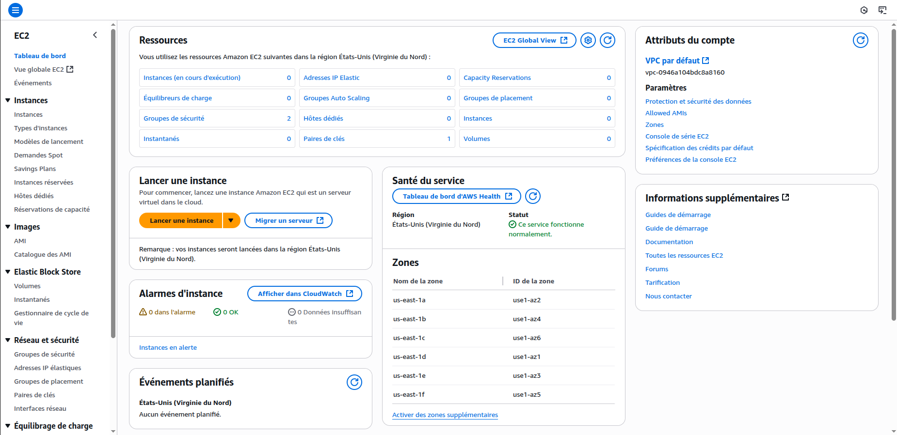

# TP 1 - Instances EC2, Auto Scaling Group et Load Balancer

## Préambule

Ce TP prend la forme d'un tutoriel. Il vous suffit de suivre les étapes à votre rythme pour arriver à la fin. Tout est expliqué et il peut être fait en autonomie sans difficulté. Le but est de vous familiariser avec la plateforme AWS et de réaliser des tâches simples. Comme vous allez le constater rapidement, AWS n'est pas une plateforme *beginner friendly*. Il y a beaucoup d'étapes et de configurations à réaliser pour lancer un service même simple. Pendant le TP, mettez-vous par groupe de 3 à 4 pour vous entraider et avancer quand je ne suis pas disponible.

Une dernière chose, le TP est probablement trop long pour être réalisé en une seule séance. Si cela arrive, il sera continué lors de la séance suivante.

🥳 **Happy coding!**

## Connexion à la console AWS

1.  Connectez-vous à la plateforme AWS Academy : [https://www.awsacademy.com](https://www.awsacademy.com) avec les identifiants que vous avez créés, puis sélectionnez le cours.
2.  Cliquez sur **Modules**, puis sur **Learner Lab**.
3.  Ensuite, cliquez sur **Start Lab**. Une fois le lab lancé (pastille verte à gauche), cliquez sur **AWS Details** et **Download PEM**. Cela va télécharger la clé privée qui permettra d'établir des connexions SSH pendant le TP.
4.  Enfin, cliquez sur **AWS**.

🎉 Vous voilà connecté(e) à la console AWS!

## Ma première instance EC2

1.  Dans la barre de recherche en haut cherchez **EC2** et cliquez sur le service. Vous arriverez sur une page similaire à la page ci-dessous :



2.  Cliquez sur **Lancer une instance** pour arriver sur l'écran de création de votre première instance EC2.

    *   **Nom et balise** : donnez un nom à votre instance. Exemple : `Ma première instance`
    *   **Images d'applications et de systèmes d'exploitation (Amazon Machine Image)** : c'est ici que vous allez choisir le système d'exploitation de votre machine. Choisissez une machine `Ubuntu` et laissez la version 24.04 sélectionnée par défaut.
    *   **Type d'instance** : regardez les différents types d'instances disponibles. Par défaut, l'instance t2.micro est sélectionnée. C'est une petite instance avec 1 vCPU (~1 cœur) et 1 Go de RAM qui conviendra parfaitement pour le TP. La famille des instances "t" est destinée à un usage général, et elles peuvent, en cas de besoin, se voir allouer plus de CPU (mais le prix augmentera). Mais si vous le souhaitez, vous pouvez choisir une t3.xlarge (4 vCPU, 16 Go de RAM, 0,16$/h) ou même une c6in.xlarge (32 vCPU, 64 Go de RAM, 1,8$/h). Si vous voulez simplement essayer, ne prenez pas une machine avec plus de 32 vCPU.
        > 💡 La taille de la machine n'affectera pas les performances du TP, vous pouvez laisser le type par défaut.
    *   **Paire de clés (connexion)** : sélectionnez la clé `vockey`. Ce paramètre définit quelle clé SSH sera reconnue par la machine. Ce paramètre est obligatoire si l'on souhaite se connecter en SSH à une instance.
    *   **Paramètres réseau** : cette configuration permet de déterminer dans quel réseau et sous-réseau se trouvera votre machine, si elle sera accessible depuis internet et les règles de pare-feu. Par défaut, votre instance sera placée dans le réseau de votre compte, dans un sous-réseau public. Cochez la case **Autoriser le trafic HTTP depuis l'Internet**. Cela rendra notre webservice accessible depuis internet.
        > 💡 AWS est une plateforme qui doit permettre à une équipe IT de recréer toute une architecture physique dans le cloud. Il y a donc beaucoup de paramètres qui ne sont pas du ressort d'un data scientist. En résumé, tout cela permet de sécuriser un système d'information en empêchant l'accès depuis l'extérieur à certaines machines (comme les bases de données) et de segmenter un gros système en zones isolées pour limiter les risques d'intrusion.
    *   **Stockage (volumes)** : laissez le paramètre par défaut. Votre machine aura un volume EBS (~un disque dur) de 8 Go.

3.  Une fois cela fait, vous pouvez lancer votre instance en cliquant sur **Lancer l'instance**. Après quelques secondes, un écran indiquant que le lancement est réussi devrait apparaître. Cliquez sur **Afficher toutes les instances**.

4.  Une fois sur le tableau de bord de vos instances, cliquez sur l'ID de votre instance pour accéder à son tableau de bord, puis copiez son **Adresse IPv4 publique**.

5.  Vous allez maintenant vous connecter à votre instance.
    *   **Ubuntu** : ouvrez le terminal avec un `Ctrl+Alt+T`, puis
        ```bash
        cd ./Téléchargements
        ssh -i "labsuser.pem" ubuntu@[adresseIPv4]
        ```
        en remplaçant `[adresseIPv4]` par l'adresse de votre instance. Entrez `yes` à la question qui vous sera posée.
    *   **Windows** : ouvrez un powershell (barre de chercher>powershell) et faites
        ```bash
        cd .\Downloads
        ssh -i "labsuser.pem" ubuntu@[adresseIPv4]
        ```
        en remplaçant `[adresseIPv4]` par l'adresse de votre instance. Tapez `yes` à la question qui vous sera posée.
    *   **MacOS** : ouvrez le terminal et allez dans votre dossier contenant votre clé téléchargée. Puis faites
        ```bash
        ssh -i "labsuser.pem" ubuntu@[adresseIPv4]
        ```
        en remplaçant `[adresseIPv4]` par l'adresse de votre instance. Tapez `yes` à la question qui vous sera posée.

    Votre terminal devra se remplir de texte et terminer par un prompt commençant par `ubuntu@XXXXX`

    🎉 Félicitation vous venez de créer une machine virtuelle et de vous y connecter !

6.  Créez via le terminal un projet cdktf . Créez un dossier tp1_ec2 et ouvrez ce dossier dans VScode. Dans un terminal saisissez la commande `cdktf init --template="Python" --providers="aws@~>4.0" --local` et validez les différentes questions (voir ce [lien](!https://developer.hashicorp.com/terraform/tutorials/cdktf/cdktf-build)). Changez l'interpréteur Python avec un ctrl+shift+p dans VS code et cherchez Python: Select Interpreter et prenez celui qui pointe vers un virtualenv. Il a Il a été créé pas Terraform et contient toutes les dépendances pour l'exercice (voir ce [lien](https://code.visualstudio.com/docs/Python/environments#_working-with-Python-interpreters)).

7. Le code necessaire pour le tp se trouve déjà dans le fichier `lab1.md`. Pour deployer l'infrastructure il suffit de faire `cdktf deploy` et de suivre les instructions. 

