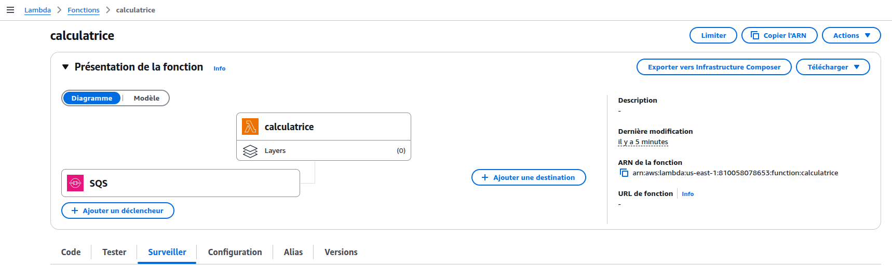
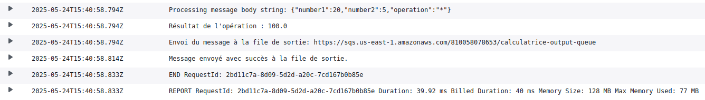

# Lab 4 : Architecture Événementielle avec Lambda et SQS - Analyse du Code ⚙️🐍📬

Bienvenue dans ce lab où nous allons explorer le code CDKTF qui déploie une architecture simple mais puissante utilisant AWS Lambda et Amazon SQS (Simple Queue Service). L'idée est de créer une "calculatrice" où les opérations à effectuer sont envoyées dans une file SQS, traitées par une fonction Lambda, et les résultats potentiellement envoyés vers une autre file SQS.

Comme j'ai eu un petit soucis au niveau de l'archivage de la lambda_function je l'ai fait manuellement et placé à la racine du projet cdktf que vous devez créer si vous partez de 0.

**Fichier concerné : `main.py` (du projet CDKTF `tp_lambda`)**

---

## 📜 Code Source (`main.py`) :

*(Les imports sont omis ici pour la clarté, mais ils seraient présents dans le fichier réel pour `Construct`, `App`, `TerraformStack`, `TerraformAsset`, `AssetType`, `AwsProvider`, `DataAwsCallerIdentity`, `LambdaFunction`, `SqsQueue`, et `LambdaEventSourceMapping`)*

```python
# Imports omis pour la concision

class MyStack(TerraformStack):
    def __init__(self, scope: Construct, id: str):
        super().__init__(scope, id)

        # 1. Configuration du Fournisseur AWS ☁️
        provider = AwsProvider(self, "AWS", region="us-east-1")

        # 2. Récupération de l'Identité AWS Actuelle (pour l'ARN du rôle) 🆔
        caller_identity = DataAwsCallerIdentity(self, "CurrentIdentity")
        
        # --- Section 3 : Création des Files SQS (Queues) --- 📬
        # File d'entrée pour les opérations de la calculatrice
        input_queue = SqsQueue(
            self, # Contexte de la stack
            "InputQueue", # ID logique CDKTF
            name="calculatrice-input-queue", # Nom réel de la file SQS
            visibility_timeout_seconds=60 # Durée pendant laquelle un message est invisible après lecture
        )

        # File de sortie pour les résultats (potentiels)
        output_queue = SqsQueue(
            self,
            "OutputQueue",
            name="calculatrice-output-queue",
            # Pas de visibility_timeout spécifique, utilise la valeur par défaut
        )

        # --- Section 4 : Préparation du Code de la Fonction Lambda --- 📦🐍
        # Définition de l'asset (le fichier .zip) contenant le code de la fonction Lambda
        code = TerraformAsset(
            self, "code", # ID logique CDKTF pour cet asset
            path="./lambda_deployment.zip", # Chemin vers le fichier .zip local
            type=AssetType.FILE # Indique que l'asset est un fichier unique
                                # (AssetType.ARCHIVE zippe automatiquement un dossier)
        )

        # --- Section 5 : Définition de la Fonction Lambda "Calculatrice" --- ⚙️🧮
        calculette = LambdaFunction(
            self,
            "CalculatorLambda", # ID logique CDKTF
            function_name="calculatrice", # Nom réel de la fonction Lambda
            runtime="python3.9", # Environnement d'exécution Python
            memory_size=128, # Mémoire allouée (en Mo)
            timeout=30, # Timeout d'exécution (en secondes)
            handler="lambda_function.lambda_handler", # Point d'entrée : fichier.fonction
            
            # Gestion du code source :
            source_code_hash=code.asset_hash, # Hash du fichier .zip pour détecter les changements
            filename=code.path, # Chemin vers le fichier .zip (CDKTF le téléverse pour nous)
            
            # Rôle IAM pour les permissions de la Lambda :
            role=f"arn:aws:iam::{caller_identity.account_id}:role/LabRole", # ARN du rôle IAM
                                                                            # IMPORTANT: Ce rôle "LabRole" doit exister
                                                                            # et avoir les permissions nécessaires (logs, SQS).
            
            # Variables d'environnement pour la Lambda :
            environment={
                "variables": {
                    "OUTPUT_QUEUE_URL": output_queue.url # Passe l'URL de la file de sortie à la Lambda
                }
            },
            
            # Dépendances explicites (bonne pratique) :
            depends_on=[input_queue, output_queue] # S'assure que les files sont créées avant la Lambda
        )

        # --- Section 6 : Liaison de la File SQS d'Entrée comme Source d'Événement pour Lambda --- 🔗🚀
        LambdaEventSourceMapping(
            self, "event_source_mapping", # ID logique CDKTF
            event_source_arn=input_queue.arn, # ARN de la file SQS qui déclenche la Lambda
            function_name=calculette.arn # ARN de la fonction Lambda à invoquer
            # batch_size=10 # (Optionnel) Nombre de messages à traiter par invocation
        )

# Initialisation et Synthèse de l'Application CDKTF
app = App()
MyStack(app, "tp_lambda")
app.synth()
```

## Section 3. Création des Files SQS (Simple Queue Service) 📬

```python
input_queue = SqsQueue(...)
output_queue = SqsQueue(...)
```

- SQS est un service de file d'attente de messages entièrement géré qui permet de découpler et de mettre à l'échelle des microservices, des systèmes distribués et des applications serverless.
- input_queue : Cette file (calculatrice-input-queue) recevra les messages contenant les opérations à calculer (par exemple, un JSON comme {"operation": "add", "a": 5, "b": 3}).
- output_queue : Cette file (calculatrice-output-queue) est prévue pour que la fonction Lambda y envoie les résultats des calculs.
- name : Le nom de la file SQS dans AWS.
- visibility_timeout_seconds=60 (pour input_queue) :
- Concept clé de SQS. Lorsqu'un consommateur (notre Lambda) lit un message de la file, ce message devient "invisible" pour les autres consommateurs pendant cette durée.
- Si la Lambda traite le message avec succès et le supprime de la file avant la fin du timeout, c'est parfait.
- Si la Lambda échoue ou que le timeout expire avant la suppression, le message redevient visible et peut être traité à nouveau (potentiellement par une autre instance de la Lambda). Cela aide à éviter la perte de messages en cas d'échec du traitement. La valeur de 60 secondes signifie que la Lambda a 1 minute pour traiter et supprimer le message.

## Section 6. Liaison de la File SQS d'Entrée comme Source d'Événement pour Lambda 🔗🚀

```python

LambdaEventSourceMapping(
    self, "event_source_mapping",
    event_source_arn=input_queue.arn,
    function_name=calculette.arn
)
```

- C'est ce qui connecte la file SQS à la fonction Lambda.
- event_source_arn=input_queue.arn : Spécifie l'ARN de la file SQS (input_queue) qui agira comme source d'événements.
- function_name=calculette.arn : Spécifie l'ARN de la fonction Lambda (calculette) qui sera invoquée lorsque des messages arriveront dans la file.
- Lorsque des messages sont disponibles dans input_queue, AWS Lambda interrogera (poll) la file et, si des messages sont trouvés, invoquera la fonction calculette en lui passant les messages comme partie de l'événement.
- Vous pouvez configurer batch_size (non montré ici, valeur par défaut 10) pour indiquer combien de messages SQS peuvent être envoyés à une seule invocation de Lambda (jusqu'à 10 000 pour les files standard, mais souvent 1 à 10 est plus gérable).


## Etat finale lorsque la Lambda est déployé sur AWS :


Vue sur aws pour la page correspondante à lambda


Pour essayer la calculatrice, vous devriez aller dans SQS (Simple Queue Service), `calculatrice-input-queue` et envoyer des messages. Ils seront traités par la Lambda et envoyés vers `calculatrice-output-queue`. Les résultats du traitement seront afficher dans l'onglet **Surveiller => Afficher CloudWatch** de lambda sur AWS.


